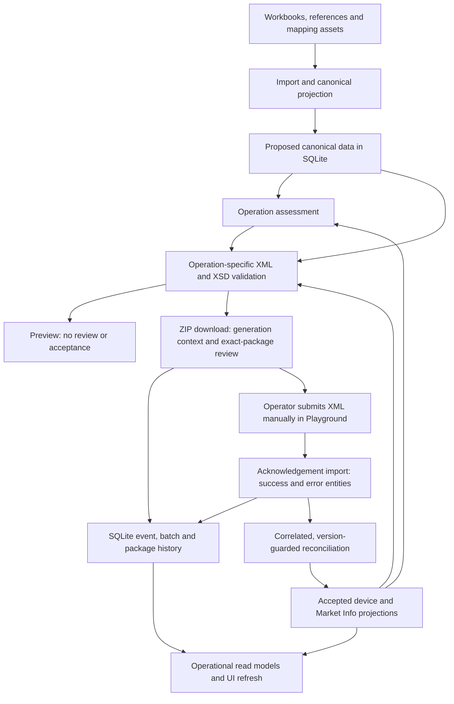

# Architecture Definition Document Draft

## Document Status And Purpose

Updated September 9, 2026 against implementation commit `355d910` — `Consolidate XML workflows and confirm review through ZIP downloads` — and the current [session handoff](session-handoff.md).

This document describes the application's architecture, responsibilities, state transitions and design boundaries. Implemented behavior is distinguished from future production and transport proposals. The handoff contains session continuity and verification details; the [Playground test report](eudamed-playground-test-report.md) contains execution evidence. Historical Playground findings do not establish current production registration state.

This is a working architecture definition. Deployment topology, formal non-functional requirements, operational ownership and production security/transport controls still require stakeholder input. This refresh changes documentation only.

## Business Context And Application Creator

The application was created in response to demand for an EUDAMED registration solution for Blatchford manufactured products.

Application creator: **Frank C Bogle, Head of Enterprise Solutions, Blatchford Mobility Ltd**.

Excel workbooks supply device data, but do not by themselves establish accepted regulatory state, stable submission lineage or reliable next-operation eligibility. The application provides a controlled preparation and testing layer between that source evidence and manual EUDAMED Playground submissions.

The immediate business objectives are to:

- Separate Basic UDI-DI parent registration, Device UDI-DI child registration, device PATCH and Market Info updates.
- Generate and locally validate operation-specific XML with traceable device identity and accepted-state lineage.
- Treat preview, operator review and EUDAMED acceptance as distinct events.
- Make bulk selection and operational counts reflect recorded state for each device.
- Retain the existing operator UI while consolidating shared backend rules and frontend orchestration.

## Scope And Delivery Boundary

Implemented capabilities include workbook import/profiling, canonical interpretation, completeness and XML-readiness checks, local XSD validation, operation assessment, single and bulk XML generation, ZIP review receipts, acknowledgement import, accepted-state projections and SQLite read models.

The six visible XML workspaces are:

| Workspace | Regulatory operation and boundary |
| --- | --- |
| POST | `DEVICE.POST` for a new Basic UDI-DI parent seed; child-only `UDI_DI.POST` when the parent already exists. |
| Patch XML | Exact-device, scenario-derived `UDI_DI.PATCH`. The only single-device PATCH workspace. |
| Market Info | Standalone `MARKET_INFO.PUT` for a registered device. |
| Bulk UDI-DI POST | Child-only registrations under accepted Basic UDI-DIs; the visible Bulk POST control selects this flow. |
| Bulk PATCH | One scenario applied to registered children, with an independent accepted baseline per device. |
| Bulk Market Info | One explicit target country list applied to registered children, with an independent starting state and next version per device. |

Bulk Basic UDI POST remains a separate supported backend/API operation. Its inaccessible frontend branch was removed, as was the old generic Single XML frontend branch. Backend single-record endpoints and directly tested generic batch compatibility helpers remain; those generic batch helper functions are not decorated HTTP routes. The former Post + Patch baseline-pair workspace is obsolete.

Out of scope for the current implementation are direct EUDAMED upload, AS4/eDelivery/M2M transport, automatic response polling, production reconciliation and the final production submission/audit model. Existing package/event history is implemented evidence, but should not be described as a complete production audit solution.

## Stakeholders And Responsibilities

| Stakeholder | Responsibility |
| --- | --- |
| Business sponsor | Business priorities, workflow direction and delivery sequencing. |
| Regulatory Affairs lead | Regulatory interpretation, valid message expectations, acceptance evidence and scenario suitability. |
| Regulatory operations user | Assess availability, inspect previews, download reviewed ZIPs, perform manual Playground tests and import all returned acknowledgements. |
| Product/source data owner | Workbook meaning, source corrections and interpretation gaps. |
| Solution architect | Separation of concerns, identity/state boundaries and controlled transition to production. |
| Engineering | Implementation, persistence, validation, regression coverage and operational feedback. |

These are responsibility assignments, not a claim that application role-based access controls are implemented. The project owner remains involved in material architecture and workflow decisions under [AGENTS.md](../AGENTS.md). ZIP download as review confirmation is an approved, implemented decision.

## Architecture Principles

1. Build a schema-aware regulatory preparation platform rather than a one-off Excel-to-XML converter.
2. Keep source evidence, canonical interpretation, validation, accepted state, XML assembly and future transport separate.
3. Treat workbook/canonical data as proposed business data, not evidence of EUDAMED acceptance.
4. Centralize operation readiness in backend assessment services and preserve exact device/parent identity across the UI workflow.
5. Keep parent POST, child POST, PATCH and Market Info as distinct operations, including in bulk processing.
6. Derive PATCH from accepted device state and retain the separately accepted Market Info countries.
7. Preview generation is a check; ZIP download confirms review of the packaged contents; only a successful acknowledgement advances accepted state.
8. Preserve immutable historical evidence while preventing old acknowledgements from rolling back newer accepted projections.
9. Retain the current UI layout and controls; remove unused branches rather than restoring unsupported operator paths.
10. Evolve the existing SQLite model incrementally, without silently reinterpreting historical data.

## Application And Logical Architecture

The application consists of a Python 3.11/FastAPI backend, a React/TypeScript/Vite frontend, source/reference/schema assets and SQLite persistence. The active operational services use the existing SQLite connection and schema-initialization mechanisms; this change does not replace them with a new database or persistence framework.

The principal operator areas are Submission Data, Registration State, Testing Summary, Canonical Validation, EUDAMED Testing and Documentation.

### Component Responsibilities

| Boundary | Current implementation and responsibility |
| --- | --- |
| Source import | `WorkbookImportService` persists workbook/source rows, resolves identities and records import drift/conflicts. Source files remain upstream evidence. |
| Canonical interpretation/projection | Canonical services normalize source concepts and persist XML-relevant fields with workbook/sheet/row lineage. |
| Canonical validation | Completeness and XML-readiness determine usable candidates. Local XSD validation independently checks generated messages; completeness does not prove schema validity. |
| Operation assessment | `OperationAssessmentService` evaluates single POST, single PATCH, single Market Info, bulk POST, bulk PATCH and bulk Market Info. It returns status, blocking reasons, eligible counts, next action, identity scope and evidence. |
| Accepted-state resolution | [accepted_state.py](../backend/app/services/accepted_state.py) supplies shared accepted POST, device/PATCH and Market Info snapshot resolution to generation and read models. |
| XML generation | Selection, projection, rendering, validation and packaging services create the operation-specific payload and envelope. `XmlGenerationService` orchestrates the workflow. |
| ZIP review | The shared download-package helper records review of the exact successfully prepared archive through `TestingStateStore`. |
| Acknowledgement reconciliation | `TestingSuccessXmlService` records response entities, correlates generated context and updates eligible accepted-state projections. |
| Operational read models | `TestingReadModelService` and import read models supply device summaries, history, batch outcomes and database/import monitoring. |

Source normalization occurs before generation. For example, `ON_THE_EU` and `ON_THE_EU_MARKET` map to `ON_THE_MARKET`. Import refresh is required for mapping corrections to reach the persisted canonical projection. [identity.py](../backend/app/services/identity.py) consolidates family/identity normalization across selection, generation, testing state and read models; it does not yet eliminate text-based identity matching.

## Data Architecture

### Source And Proposed State

File-backed inputs include Excel workbooks, Basic UDI reference data, mapping/configuration assets and the local EUDAMED schema pack. SQLite stores the imported source evidence and canonical projection used by the testing workflows.

Canonical records retain source lineage, catalogue/Device UDI-DI/Basic UDI-DI identity, regulatory field paths and readiness results. They represent proposed data. Re-importing a workbook does not itself change accepted EUDAMED state.

### Implemented SQLite Model

Default database: `data/testing/testing-state.sqlite3`, configurable through `EUDAMED_TESTING_STATE_DB_PATH`. Backup location and retention are configurable; backups default to `data/testing/backups`.

| State area | Tables and role |
| --- | --- |
| Import evidence | `import_batch`, `source_workbook`, `source_row` preserve imported source context. |
| Stable identity and issues | `device_subject`, `device_identity_issue` link source rows to devices and retain conflicts requiring attention. |
| Canonical projection | `canonical_device_record`, `canonical_field_value`, `canonical_projection_snapshot` persist interpreted/validated source data. |
| Accepted testing projections | `testing_subjects` holds registration flags, separate accepted POST/PATCH/Market Info versions and snapshots, and observed Market Info version evidence. |
| Per-device history | `testing_events` stores generated contexts and acknowledgement events with envelope, scenario, version and before/after metadata. |
| Batch lineage | `testing_batches`, `testing_batch_devices` group envelopes and per-device outcomes. Batch read APIs and a backfill service are implemented. |
| Package/review evidence | `generated_packages` stores package metadata, archive fingerprints and exact-member review receipts. |
| Legacy POST history | `reviewed_post_baselines` retains historical POST-download indicators; it is not a gate or proof of review of a current draft. |

`device_subject` is the intended stable application identity. `testing_subjects` and legacy reviewed POST rows already have `device_subject_id` links. Some selection and lineage resolution still use family/variant/catalogue strings, aliases and UDI matching. Compatibility fields including `post_success`, `latest_successful_version` and `latest_successful_state_json` remain in use.

The model is an operational projection plus recorded history. It is not a claim of complete event sourcing, universal replay, complete historical snapshots or production audit certification.

## Review And State-Transition Contract

| Action | Persisted meaning | Effect on accepted state |
| --- | --- | --- |
| Import/re-import source data | New source/canonical projection and import evidence. | Does not establish regulatory acceptance. |
| Generate ordinary preview | Candidate XML and validation feedback; no ZIP review receipt or ordinary submission-context write. | None. |
| Log generation context | Append-only generated payload context. This alone does not prove review. | None. |
| Download ZIP | Generation context for supported submission flows, package metadata and review of the exact prepared ZIP. | None. |
| Edit the draft afterward | A different proposed device/scenario/version/country state. The earlier review remains history only. | None. |
| Import successful acknowledgement | Recorded success; accepted-state update only where correlation/version rules permit. | May advance the relevant accepted projection. |
| Import error acknowledgement | Error evidence and, when reported, a Market Info observed version floor. | Does not accept the rejected payload. |

### ZIP Review Receipt

The owner confirmed that downloading a ZIP is the explicit review action in every XML ZIP workflow. No additional review button is required, and preview generation must not require a previous POST ZIP download.

All eight ZIP download paths call `XmlGenerationService._build_and_record_package`: single POST, scenario PATCH, single Market Info, bulk Basic UDI POST, bulk UDI-DI POST, bulk PATCH, bulk Market Info and the generic batch compatibility helper. Raw XML-only downloads do not create ZIP-review receipts.

After successful archive construction, `record_generated_package(..., confirms_review=True)` stores:

- `package_sha256`: the exact archive fingerprint.
- `reviewed_at` and `review_basis = zip_download`: the review action and time.
- `reviewed_members_json`: file names and SHA-256 hashes of every archive member, including the manifest.
- Existing flow, scope, filename, size and manifest metadata.

This records the explicit download request and successfully prepared contents; it does not verify an operating-system file save. Failed archive preparation leaves no receipt. The default package-recorder call uses `confirms_review=False`, so package creation metadata alone is not treated as review.

A review attaches to that artifact, not indefinitely to a device. Changing a scenario, version, country list or other packaged contents requires another download to record review of the changed artifact. Previous receipts remain historical evidence. The package table stores hashes and metadata, not duplicate XML bodies or ZIP blobs; operators must retain downloaded artifacts.

The three nullable review columns are added through existing schema initialization. Historical package rows are not backfilled as reviewed. Legacy POST history is maintained only after successful POST ZIP preparation. The optional reviewed-POST PATCH gate has been removed; the compatibility evidence field `reviewed_post_baseline_present` is historical information, not current-draft review or a readiness prerequisite.

## Accepted-State And Operation Design

### POST And Child Registration

Single POST is assessment-first: the family/variant selection resolves the next eligible candidate, avoiding already registered Device UDI-DIs. An unregistered Basic UDI-DI requires a parent seed using `DEVICE.POST`; subsequent child-only registration uses `UDI_DI.POST` and references that parent through `basicUDIIdentifier`.

Bulk Basic UDI POST keeps parent registration separate at the backend/API boundary. Bulk UDI-DI POST includes eligible unregistered children under accepted parents. A source row or reviewed ZIP does not establish parent/child registration success.

New POST generation contexts capture the complete `DeviceXmlRecord` projection, including nested warnings, storage conditions and market countries. Only a matching successful acknowledgement promotes that context into accepted POST state.

### PATCH Lineage

Single PATCH retains the exact selected device across assessment, baseline loading, scenario generation, download and acknowledgement refresh. Family/variant context alone must not silently switch to another sibling device.

- Version 2 derives from accepted POST state. Equivalent First Patch changes the version without a business-field delta; a supported edit can instead be the first targeted update.
- Later scenario PATCHes apply the accepted PATCH fields over the accepted POST projection. Non-target values retain accepted state rather than adopting subsequent workbook edits.
- PATCH payloads repeat the latest separately accepted Market Info country list. Later accepted Market Info takes precedence over original POST and workbook countries.
- Baseline loading for PATCH/Market Info requests the accepted projection with `accepted_baseline=True`.
- Bulk PATCH uses the same per-device derivation logic. A cohort does not share one assumed accepted version. Download resolves its generated preview's included records rather than silently restoring excluded devices.

Older accepted entries can have partial snapshots or no snapshot. Compatibility fallback remains for unavailable historical fields. Complete protection from workbook drift cannot be claimed for data never captured in accepted history; that recovery problem is still open.

Current testing eligibility relies on tracked successful registration and available accepted lineage. A loaded baseline is a readiness condition, not a review event. Accepted-registration, version, scenario and unresolved Market Info rejection guards remain after removal of the old review prerequisite.

Scenario implementation and regulatory suitability are separate. Sterile and Latex are disabled in the UI following recorded Playground rejection, even though lower-level XML builders exist. Status Code remains an enabled testing scenario with failure evidence. Candidate scenario entries must not be represented as universally accepted EUDAMED updates. Current scenario availability is detailed in the handoff and source configuration.

### Market Info And Bulk Market Info

`MARKET_INFO.PUT` has an independent accepted country snapshot and version. Success does not advance the core device/PATCH version.

The next proposed Market Info version is `max(accepted Market Info version, observed EUDAMED version floor) + 1`. A reported version-scheme error can raise the observed floor without accepting the proposed countries. Single Market Info validates the supplied version against the observed floor; bulk generation derives each device's next version separately.

Both assessment and generation allow mixed accepted starting country lists for one explicit bulk target list. The earlier mixed-baseline decision is resolved. Accepted state differing from source-workbook countries is not itself a PATCH exclusion.

An unresolved `marketInfoLink` PATCH rejection is a device-specific pending condition. A later successful Market Info acknowledgement clears that condition before another PATCH is attempted. After success, the UI uses SQLite accepted countries rather than the user's most recent unsent draft.

These are the implemented, evidence-led testing rules. Production integration must validate its version/state contract explicitly; it must not reuse the PATCH counter as a substitute for missing Market Info state.

## Acknowledgement Correlation And Audit History

The upload endpoint supports `DEVICE.POST`, `UDI_DI.POST`, `UDI_DI.PATCH` and `MARKET_INFO.PUT`, including multi-entity success/error responses. Every returned acknowledgement should be imported before a dependent next operation.

Generation context is tied to the actual downloaded XML envelopes. Bulk Market Info records every included device against the downloaded chunk's shared correlation/message IDs. Generated events remain append-only; ordinary repeated previews do not create that submission history.

Correlation follows this order:

1. Match subject, message type, correlation ID and message ID.
2. If appropriate, match the same correlation ID when the response uses a different message ID.
3. For acknowledgements without identifiers, permit the legacy fallback only when exactly one generated candidate exists.

An identified acknowledgement with no matching correlation cannot accept an arbitrary latest draft. An acknowledgement may establish a tracked version without enough context to recover its payload; another draft must not be invented as its accepted snapshot.

Duplicate imports are idempotent. Older successes remain in history without rolling newer accepted version/state projections back. Duplicate processing can repair missing projections where trustworthy generated context exists. Error entities retain evidence independently and do not advance accepted payload state.

`testing_events` includes `event_kind`, scope, batch/envelope IDs, scenario, base/derived versions, accepted-state source, before/after state and delta metadata. Legacy status values such as `GENERATED` and `SUCCESS` remain. Batch envelopes, per-device events and ZIPs are separate concepts: one ZIP may contain multiple envelopes/devices, so package receipts must not be treated as individual device acceptances.

## Frontend And Read-Model Architecture

Retain the existing assessment cards, scenario editors, preview cards, metadata/status strips, XML structure navigation and acknowledgement controls. The consolidation changes the ownership of decisions and removes disconnected branches, rather than adding new operator steps.

- `/api/xml/operation-readiness` provides per-record dashboard/registration flags using the same backend rules as operation assessment, including the separate single Market Info assessment.
- [xmlAssessmentRequest.ts](../frontend/src/xmlAssessmentRequest.ts) is the shared dispatcher for initial assessment and acknowledgement refresh.
- [useSuccessXmlUpload.ts](../frontend/src/useSuccessXmlUpload.ts) checks operation, family, variant, catalogue and parent scope before applying asynchronous upload results to the visible workspace.
- [useBulkPostedCohorts.ts](../frontend/src/useBulkPostedCohorts.ts) loads posted parents/devices from backend queries for bulk PATCH/Market Info. Workbook row-count estimates and sample-catalogue fallbacks no longer substitute for actual cohorts.
- Frontend readiness says **accepted baseline loaded**; POST review is labelled as history. Download feedback confirms review of the ZIP without marking the generated update as accepted.
- Shared normalization and accepted-state resolution reduce divergent frontend/backend interpretations. Remaining text/alias matching is transitional and must stay consistent until relational identity work replaces it.

Submission Data reads SQLite import/snapshot/monitoring information; it is not a live direct-Excel inventory. Registration State and Testing Summary consume operational readiness and history. `App.tsx` remains substantial, but the removed Single XML/Bulk Basic UDI UI branches, unused clients/types/state and generic preview component are no longer current risks to remove again.

## Configuration, Evidence And Verification

The repository defaults to Python 3.11, message schema `3.0.32` and a configurable batch limit of 300. XML testing services use the imported canonical projection; compatibility/non-import-required service paths can still use workbook fallback.

Testing actor configuration includes `EUDAMED_MANUFACTURER_SRN_OVERRIDE`, `EUDAMED_AUTHORISED_REPRESENTATIVE_SRN_OVERRIDE` and `EUDAMED_SUPPRESS_AUTHORISED_REPRESENTATIVE`. These controls must match the actual testing environment. The message-schema default reflects the recorded August 9 Playground requirement and bundled local schema; it is not a newly verified public EUDAMED release claim.

Earlier Navigator/Javelin/Linx testing established the Market Info/PATCH reconciliation safeguards: the recorded sequence included 29 Market Info successes and one version error, a successful corrective single Market Info version 3, and a subsequent 31-device bulk PATCH success. Detailed subject IDs and action labels belong in the test report/handoff; those historical results do not prove current inventory or live environment behavior.

Last implementation verification recorded on September 9:

- Full backend suite: 147 tests passed.
- Focused ZIP-review run: 15 tests passed, including an additional accepted-state regression added during the full run; 148 distinct backend tests were exercised across the runs.
- Frontend: 11 Node-based TypeScript/helper/hook tests passed through `npm --prefix frontend test`.
- Production builds include TypeScript unused-local/parameter checks. These tests are not full browser interaction or visual-comparison tests.

The preceding handoff refresh reduced bundled Markdown enough to remove the Vite bundle-size warning. Recheck the production build when editing imported documentation. This architecture refresh validates its links, diff and frontend build; the backend suite is not rerun merely for prose changes.

## Current Constraints And Remaining Risks

- Playground state and production registration truth may differ. Source classification, ZIP review and local XSD validity are not substitutes for accepted regulatory evidence.
- Legacy partial/missing snapshots limit historical reconstruction and source-drift protection. Trusted recovery needs deliberate design.
- Some identity resolution still uses strings/aliases alongside `device_subject_id` links. Cleanup must preserve source and event lineage.
- Per-device bulk derivation may be expensive for larger selections. Measure representative workloads before changing generation or snapshot semantics.
- The latest consolidation and ZIP-review changes still need manual browser and controlled Playground verification.
- Artifact hashes identify reviewed contents but do not provide archive recovery. Operators must retain ZIP/XML artifacts; broader retention/replay controls are not complete.
- `App.tsx` can benefit from further bounded extraction, but existing workflow layout and controls should remain stable.
- Deployment, access control, operational support and formal audit requirements are not settled by the current local testing architecture.

## Transition Roadmap And Production Proposals

The next implementation priorities are operational verification, trusted handling of legacy accepted-state gaps and gradual migration from text matching to stable device-subject joins. Batch tables, accepted-state snapshots, package review receipts and assessment contracts are already implemented; they are not prerequisites still waiting to be built.

Broader canonical/submission persistence, richer scenario intent and replay tooling should be separate increments. Additional dependencies or generic workflow abstractions are not implied by this documentation update.

### Future Production Eligibility

The current testing mode relies on recorded registration and accepted lineage. A future production mode may support devices registered outside this application without a locally generated POST, but only after trusted identity, lifecycle and accepted-state sourcing are defined.

Workbook/reference classification as PATCH is context, not sufficient proof of accepted state. POST classification also does not bypass existing-registration checks. The production transition must preserve duplicate-registration prevention and the distinction between proposed and accepted data.

Candidate sources for production version/state resolution are live EUDAMED lookup, controlled authoritative source records and explicitly confirmed operator evidence. Their authority, freshness and reconciliation rules require a separate decision; none is an implemented transport capability today.

Market Info remains a separate state/version domain in the current design. Production contract validation must establish any required differences before implementation rather than assuming coupling with PATCH.

### Later Transport And Governance

Only after the manual workflow and state model are proven should the project design automated submission, polling, retries, reconciliation, production security and support ownership. Formal availability/performance requirements, deployment topology, artifact retention, audit expectations and access-control responsibilities still need stakeholder input.

The current architecture decisions are settled for this delivery slice: SQLite remains active; parent/child/update flows remain distinct; backend assessment owns readiness; accepted snapshots govern derivation where available; ZIP download confirms exact-artifact review; acknowledgement reconciliation alone changes accepted state; and the existing visible UI is retained.
